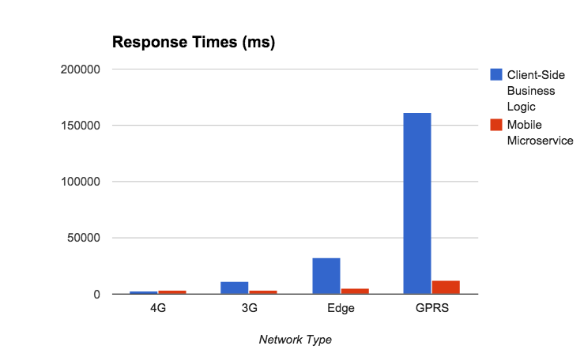

#Part 1: A MicroServices Primer
There seems to have been a tangible explosion in the use of the term “micro services”. I’ve been peripherally aware of the concept for some time now, but it seems it first came to light with a fantastic collection of thoughts by Martin Fowler[1] - some great reading on the topic.

This three part series of posts will not help you make a business case for rewriting your existing monolith as a series of microservices. I'm not going to quantify your ROI, or "leverage synergies". Instead, I'm going to show how microservices make sense for mobile in a series of practical, example-driven posts. 

* Part one will illustrate using hands-on examples just how easy it can be to get started with microservices. 
* Part two will introduce mobile-specific microservice considerations
* Part three will use what we learned in the previous two posts to benchmark the drastic impact microservices based architectures can have on mobile. 

## Microservices - The Term
  
I’ve been somewhat amused by the term microservices, since we've been composing small, loosely coupled applications which combine to do work since I first started using Node.js with FeedHenry. I'd love to claim some visionary stroke of trend-predicting genius, but really it’s the path the Node.js community lead us down.  
  
What started as cries of “Make everything you possibly can small re-usable modules” (micromodules anybody?) quickly became "make everything small re-usable applications”, and now we're calling them microservices. Great! Call them turnips for all I care.  
Now, let's look at some simple examples of microservices. 

##What's a Microservice Look Like?

###The Tale of the Travelling Umbrella Salesperson
To illustrate the use of microservices, let's take a mock use case, that of a travelling umbrella salesperson (of no relation to the Travelling Salesperson of Distributed Computing fame). This salesperson needs to be able to:

1. Create orders in a backend database
2. Automatically scale their order quantities according to the weather (I know - work with me here, people..)
3. Notify the account manager of the new order on their account

### Our first Microservice - Orders
First, we're going to create a micro service for orders for our travelling umbrella sales team. We're going to write our microservices in Node.js, and they're going to communicate JSON payloads over HTTP, but these are by no means prerequisites. Microservices can of course be implemented using any programming language, over any communication protocol.
Here's a service which can both create and list umbrella orders. It creates a REST api, `/orders`. 

    var app = require('express')().use(require('body-parser')());
    var orders = [];
    // Create a new order
    app.post('/orders', function(req, res){
      orders.push(req.body);
      return res.json(req.body);
    });
    // list orders
    app.get('/orders', function(req, res){
      return res.json(orders);
    });

    var server = app.listen(3000);
    
Ten lines - pretty micro, huh? Ok, so I cheated a bit - that first line is concise to the point of unreadable, and we're just putting orders in memory - but we now have a _really micro_ service. 
  
_For future code snippets, I'm going to drop some of the boilerplate setup code._

## Adding more Microservices - Weather & SMS
Our order service is working just fine - our folk out in the field can create orders, and list the orders they've previously created. 
But before the team creates an order, they want the system to scale their order size based on the upcoming weather forecast at that location. Let's call this the rain service.
Here, we're going to reach out to a third party API, sum the rainfall totals for the upcoming forecast, and append it to the original weather information. 

    var weatherUrl = 'http://api.openweathermap.org/data/2.5/forecast';

    app.get('/rain', function(req, res){
      var city = req.query.city, 
      country = req.query.country;
      
      request.get({url : weatherUrl + '?q=' + city + ',' + country, json : true}, function(err, response, weatherbody){
        // sum all the inches rainfall in the forecast
        weatherbody.rainfall = _.reduce(weatherbody.list, function(a, b){ return a + b.rain['3h'] }, 0);
        return res.json(weatherbody);
      });
    });
    
Lastly, we're also going to add a service to allow us to push an SMS alert to the account manager when a new order is created. 

	app.post('/sms', function(req, res){
	  var to = req.body.to, 
	  message = req.body.message;
	  client.sms.messages.create({ to: to, from : process.env.TWILIO_NUM, body : message}, function(error, message){
	    return res.json(message);
	  });
	});
	app.listen(3002);
	
We've now created our series of 3 microservices. To get started with the examples provided, follow these steps in a terminal: 

	# clone the repository
    git clone https://github.com/cianclarke/microservices-primer.git ; cd microservices-primer
    # Install dependencies
    npm install -d
    # Set Twilio environment variables
    export TWILIO_AUTH=foo; export TWILIO_SID=bar; export TWILIO_NUM="+1234567";
    # start the 4 microservices & the test runner
    npm start
    
We're now running our series of microservices, and can interact with them using CURL:

	# Service 1: Create a new order in the database
	curl 'http://127.0.0.1:3000/orders/umbrellas' -H 'Content-Type: application/json' --data-binary '{"city":"Dublin","country":"Ireland","quantity":984.4999999999999,"accountManager":"+1 123 456 789"}'
	
	# Service 1: List orders in the database
	curl http://127.0.0.1:3000/orders/umbrellas
	
	# Service 2: GET request to rain service to retrieve information for Dublin, Ireland
	curl 'http://127.0.0.1:3001/rain?city=Dublin'

	# Service 3: POST to the SMS service
	curl 'http://127.0.0.1:3002/sms' -H 'Content-Type: application/json' --data-binary '{"to":"+1 123 456 789","message":"My SMS Message!"}'
  	
  

====================================================================

#Part 2: Microservices Considerations for Mobile
In part 1 of this series, we set up a series of three microservices to interact with, using Node.js as the serverside technology.  

Now, let's pause to consider how we consume this API.  
Introducing a microservices based architecture has some specific considerations when it comes to delivering content to mobile applications. I'm going to deal with two main concerns - coupling and performance. 

### Loose-Coupled, Tight-Coupled, Practically Welded Shut
For web applications, if we change the API we know that once we deploy an update to the web application, all our connected clients are using the new API. It's easy to swap out URLs, and even expected payloads in the code of the web application, because we can deploy in tandem. Then, we can deprecate the old API. This makes for a relatively loose coupling between client and server.
  
A mobile application is released into an App Store. In an enterprise environment, we can usually force out an update to our app & watch it propagate to users within a matter of days. This makes the relationship between client and API more tightly coupled.  

If it's an app in the public App Store, there may be a review period. Once released, users download this update over the course of weeks, months, maybe never. The previous API still needs to be maintained, and this makes for an integration which is so tightly coupled, it's practically welded shut. (See, these days everybody is coining new terms!)  
This makes for some very special considerations when architecting for mobile.

### Performance Considerations
The other major consideration specific to mobile is performance. Web applications typically run on devices connected over WiFi or Ethernet, with low latency.  
Mobile devices often connect over lossy connections - 3G, Edge, or even GPRS. 

Returning the minimum payload required to render the screen is more important now than ever. Intelligent pagination on lists can drastically reduce payload size, especially when users are only operating on the most recent items. 

This also means reducing the number of calls made across the network. As the number of calls grow, every HTTP transaction can contribute to an exponential growth in overall response time. A unified mobile API which returns data from many sources in one single call is often a good option.  
This can introduce some interesting trade-offs which need to be balanced:  
1. At what point does a unified API returning multiple types of data compromise the RESTful nature of an API
2. At what point does the response body size of a combined payload negate any potential performance gains

### The Internet of Things - The Great Reset
The Internet of Things (IoT) introduces a whole new wave of device form factors. With this wave of devices comes an effective reset of our expectations. This paradigm shift of expectations mirrors the early days of Mobile, when we had heavily resource constrained devices. Along with Microservices specific to mobile, as IoT enabled devices are rolled out it's worth considering microservices catering to their specific needs.  
Many IoT devices will be incapable of performing HTTPS due to the computationally expensive overhead of the SSL handshake process. 
Payloads will need to be trimmed even further - even JSON bodies are both too large, and too costly to parse. Think lighter weight protocols like MQTT[2].  
Performance considerations are even more important when considering IoT devices.

====================================================================

#Part 3: Taking our Microservices Mobile
Now that we've built our microservices, we're going to bring them to a mobile device. 
We're going to try doing this two ways. 

### Take 1: Client-Side Business Logic
First, we'll build this application how many existing mobile apps are built - we'll implement a lot of business logic on the client (steps 1, 2 and 3 above), and make three separate REST calls from the mobile device.  

Sure, we've still got microservices on the server-side - but we could equally picture this as a monolith, for what little use we're making of the microservices philosophy.  

	        +--+                   +--------+-----+ 
	        |  |  Boston, USA      |Rain Service  | 
	+-------+---------------------->              | 
	| Mobile   |full weather data  |              | 
	| Client   +-------------------+              | 
	|          |                   +--------------+ 
	|          |                                    
	|          | { order }         +---------------+
	|          +-------------------> Order         |
	|          |  stored OK        | Storage       |
	|          +-------------------+ Service       |
	|          |                   |               |
	|          |                   +---------------+
	|          |                                    
	|          |to:+1234 msg:order!+--------+------+
	|          +---+---------------> SMS Service   |
	|          |                   |               |
	|          +-------------------+               |
	+----------+                   +---------------+
This illustrates the "wrong way". Now, let's examine an improved approach. 

### Take 2: Microservices for Mobile
As before, we're going to achieve this integration using a series of microservices - but we're going to meld the data together in a fourth and final mobile-specific microservice. 

		
		                        +-------------+                   +--------+-----+ 
		                        |             |  Boston, USA      |Rain Service  | 
		                        |             +------------------->              | 
		        +--+            |    Mobile   |full weather data  |              | 
		        |  |            |    Ordering <-------------------+              | 
		+-------+--+            |    Service  |                   +--------------+ 
		| Mobile   |   { order }|             |                                    
		| Client   +------------>             | { order }         +---------------+
		|          |            |             +-------------------> Order         |
		|          |            |             |  stored OK        | Storage       |
		|          |            |             <-------------------+ Service       |
		|          |            |             |                   |               |
		|          |            |             |                   +---------------+
		|          |            |             |                                    
		|          |            |             |to:+1234 msg:order!+--------+------+
		|          |            |             +---+---------------> SMS Service   |
		|          | created OK |             |                   |               |
		|          <------------+             <-------------------+               |
		+----------+            +-------------+                   +---------------+

Now, we send our order information to a new mobile ordering microservice, which implements all this business logic on the server side. 
We've got one simple API to maintain, a perfectly reasonable POST of a JSON payload, and this integration becomes a much looser coupling. We're not sending unnecessary data back to the mobile app. 
	
##Benchmarking
Now, let's see how do these two approaches compare across a range of mobile network types. If interested, some notes on the benchmarks are available in the footnotes[3].

A simple mobile client implementing the two approaches to integrating discussed above was created, which also measures request time across each approach. 

### Payload Size
First, a brief look at the total payload size over 100 requests. 
Using the mobile microservice, __68kb__ of data was exchanged. Calling each microservice individually resulted in **1.5mb** of data, a substantial increase likely due to returning weather information in it's entirety on every request.  

### Response Times

Examining the results, we see nominal difference between approaches using a 4G network. When we move to a 3G network, the gap widens - there's **8 seconds** in the difference across requests.
Edge networks show a wider gap still, with an increase in average request time of almost **27 seconds**. At this point, the end user would really feel the pain of an inferior architecture. 
Lastly, over GPRS the impact of implementing multiple calls on the client is eye-opening. With average request times of **over 2 minutes**, the application would be effectively unusable. Compare this to a microservice based architecture, with response times averaging 12 seconds, the application is slow but still usable. 
The key take away from this benchmark is as the network slows, **response time grows exponentially** when not considering mobile in your microservice architecture.

    # To run these benchmarks, clone [the repository](https://github.com/cianclarke/microservices-primer).
    git clone https://github.com/cianclarke/microservices-primer.git ; cd microservices-primer
    # Install dependencies
    npm install -d
    # Set Twilio environment variables
    export TWILIO_AUTH=foo; export TWILIO_SID=bar; export TWILIO_NUM="+1234567";
    # start the 4 microservices & the test runner
    npm start
    # To view the test runner, visit http://localhost:3004/ in a browser.

## Conclusion
Having seen some drastic results, what can we conclude from these benchmarks? I'm not going to try make such bold, linkbait-esque claims as "Microservices make mobile 10x faster" - that's simply not true. 
What is true, however, is that the rollout of a Microservices based architecture needs to consider mobile as a first class citizen. Not doing so will ruin the user experience for end users, and render applications virtually useless on slower networks. 
If the above considerations are taken into approach, the rollout of this new breed of architecture should prove a much smoother transition. 

[1] [http://martinfowler.com/articles/microservices.html](http://martinfowler.com/articles/microservices.html)  
[2] [http://mqtt.org/](http://mqtt.org/)  
[3] 100 requests in each run. SMS API calls to Twilio simulated with 250ms timeout to avoid excessive calls to their API. Chrome Developer Tools network throttling used to simulate network speeds. Node.js processes restarted after every batch of 100 requests. Requests had timestamp appended to prevent browser caching. 